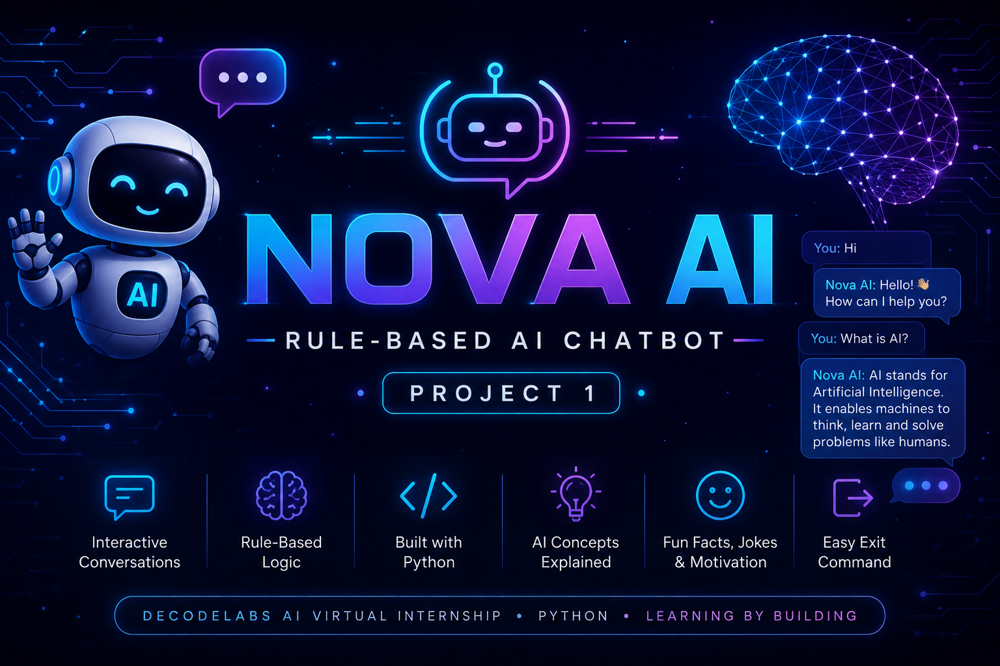

<p align="center">
  
</p>

<h1 align="center">🤖 Nova AI</h1>

<h3 align="center">Rule-Based AI Chatbot • DecodeLabs AI Project 1</h3>

<p align="center">
  A simple and interactive rule-based chatbot built with Python.
</p>

<p align="center">


</p>

---

## 👋 Hi there, I'm Nova AI!

> **A friendly rule-based AI assistant built to demonstrate the fundamentals of AI and Python.**

Nova AI is a **Rule-Based AI Chatbot** developed using Python as part of the **DecodeLabs AI Virtual Internship – Project 1**.

The chatbot interacts with users through predefined commands and uses **if-elif-else decision-making** to generate appropriate responses.

---

## 📌 Overview

This project focuses on the fundamentals of:

- 🧠 Basic AI concepts
- 🔀 Decision-making logic
- 🔄 Control flow
- 💬 User interaction
- 🐍 Python programming
- 📋 Rule-based response generation

The chatbot runs continuously until the user enters an exit command such as `bye` or `exit`.

---

## ✨ Features

- 👋 Personalized greeting using the user's name
- 🤖 Introduces itself as Nova AI
- 🌞 Good morning, afternoon and evening greetings
- 💬 Responds to "How are you?"
- 🙋 Remembers the user's name
- 🧠 Explains Artificial Intelligence
- 🌍 Lists applications of AI
- 👨‍💻 Explains who created the chatbot
- 😂 Tells a programming joke
- 💡 Shares an interesting fun fact
- 💪 Provides a motivational message
- 🙏 Responds to "Thank you"
- 📖 Provides a help menu
- 🚪 Supports `bye` and `exit` commands
- ❓ Handles unknown inputs

---

## 💬 Available Commands

| Command | Response / Function |
|---|---|
| `hi` / `hello` | Greeting |
| `good morning` | Morning greeting |
| `good afternoon` | Afternoon greeting |
| `good evening` | Evening greeting |
| `how are you` | Chatbot status |
| `what is your name` | Chatbot introduction |
| `what is my name` | Displays user's name |
| `who created you` | Creator information |
| `what is ai` | Explanation of Artificial Intelligence |
| `applications of ai` | Applications of AI |
| `tell me a joke` | Programming joke |
| `fun fact` | Interesting computer fact |
| `motivate me` | Motivational message |
| `thank you` | Friendly response |
| `help` | Displays available commands |
| `bye` / `exit` | Ends the conversation |

---

## 🛠️ Technologies Used

- **Python 3**
- **Visual Studio Code**
- **GitHub**
- **Markdown**

---

## 🧩 Python Concepts Used

The project demonstrates several fundamental Python concepts:

- Variables
- `input()` function
- `print()` function
- `if-elif-else` statements
- `while` loop
- `break` statement
- `.lower()` string method
- f-strings
- User interaction

---

## 🔍 How It Works

The chatbot follows a simple rule-based process:

```text
User enters a message
        ↓
Input is converted to lowercase
        ↓
if / elif conditions check the input
        ↓
Matching response is displayed
        ↓
Chat continues
        ↓
User enters "bye" or "exit"
        ↓
Chatbot ends
```

---

## ▶️ How to Run

### 1. Install Python

Make sure Python 3 is installed on your computer.

### 2. Download or clone this repository

```bash
git clone <your-repository-link>
```

### 3. Open the project folder

```bash
cd Nova-AI-Rule-Based-Chatbot
```

### 4. Run the chatbot

```bash
python chatbot.py
```

### 5. Start chatting with Nova AI! 🤖

---

## 💻 Sample Interaction

```text
==================================================
🤖 Welcome to Nova AI
Your Friendly Rule-Based AI Assistant
==================================================

Before we begin, what's your name? Harshita

Hello, Harshita! 😊
I'm Nova AI. Type 'help' to see what I can do.
Type 'bye' or 'exit' anytime to end the chat.

Harshita: hi
Nova AI: Hello Harshita!👋 Hope you're having a wonderful day!

Harshita: what is ai
Nova AI: AI stands for Artificial Intelligence.
It is a branch of computer science that enables machines
to perform tasks that normally require human intelligence,
such as learning, reasoning, problem-solving, decision-making,
understanding language, and recognizing patterns.

Harshita: tell me a joke
Nova AI: 😂 Why do Python programmers wear glasses?
Because they can't C!

Harshita: bye
Nova AI: It was wonderful talking to you, Harshita!😊
Goodbye!👋
```

---

## 📂 Project Structure

```text
Nova-AI-Rule-Based-Chatbot/
│
├── chatbot.py
├── README.md
└── banner.png
```

---

## 🎯 Project Objective

The objective of this project is to build a simple **rule-based AI chatbot** that demonstrates:

- Control flow
- Decision-making
- Predefined responses
- Continuous interaction
- Basic AI concepts

---

## 🚀 Future Improvements

Possible future versions of Nova AI could include:

- 🎤 Voice-based interaction
- 🖥️ Graphical User Interface
- 🧠 Machine Learning integration
- 💾 Chat history
- 🌐 Multiple language support
- 🔊 Speech recognition
- 🤖 More advanced conversational capabilities

---

## 👩‍💻 Author

**Harshita**

DecodeLabs AI Virtual Internship  
**Project 1 — Rule-Based AI Chatbot**

---

<p align="center">

⭐ **Thank you for visiting Nova AI!** ⭐

</p>
